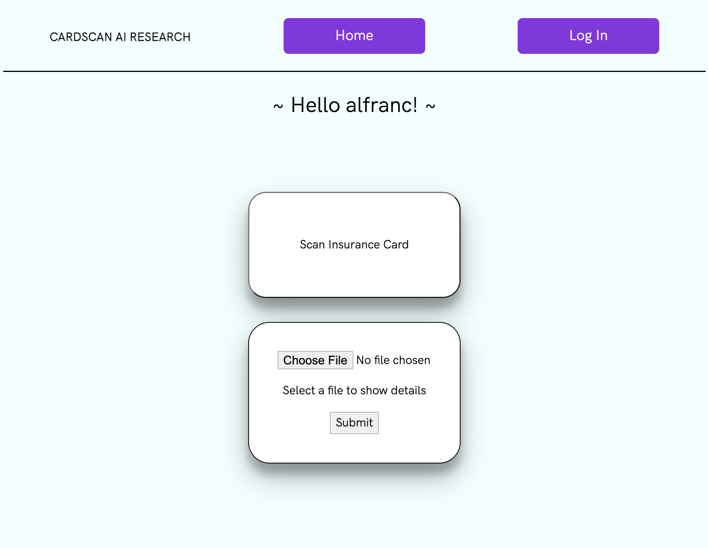

<div id="top"></div>


<!-- PROJECT LOGO -->
<br />
<div align="center">
  <a href="https://github.com/morancathy/notes-rails-react-frontend">
    
  </a>

<h3 align="center">Cardscan AI Research</h3>

  <p align="center">
    <br />
    <a href="https://github.com/morancathy/notes-rails-react-frontend"><strong>Explore the docs »</strong></a>
    <br />
    <br />
    <a href="https://github.com/morancathy/notes-rails-react-frontend">View Demo</a>
    ·
    <a href="https://github.com/morancathy/notes-rails-react-frontend/issues">Report Bug</a>
    ·
    <a href="https://github.com/morancathy/notes-rails-react-frontend/issues">Request Feature</a>
  </p>
</div>


<!-- TABLE OF CONTENTS -->
<details>
  <summary>Table of Contents</summary>
  <ol>
    <li>
      <a href="#about-the-project">About The Project</a>
    </li>
    <li>
      <a href="#getting-started">Getting Started</a>
      <ul>
        <li><a href="#prerequisites">Prerequisites</a></li>
        <li><a href="#installation">Installation</a></li>
      </ul>
    </li>
    <li><a href="#usage">Usage</a></li>
    <li><a href="#roadmap">Roadmap</a></li>
    <li><a href="#acknowledgments">Acknowledgments</a></li>
  </ol>
</details>


<!-- ABOUT THE PROJECT -->
## About The Project



Research project on [cardscan.ai](https://docs.cardscan.ai/) API by [Cathy Moran]() and [Alex Franco](). CardScan.ai is the fastest way to add insurance card scanning to your mobile (iOS, Android) application, web application, or backend systems.

<p align="right">(<a href="#top">back to top</a>)</p>


<!-- GETTING STARTED -->
## Getting Started

To get a local copy up and running follow these simple example steps.

### Prerequisites

* Upgrage npm and install yarn
  ```sh
  npm install -g npm@latest
  npm install -g yarn
  ```

* Choose the best Ruby & Node version manager ([ASDF](http://asdf-vm.com/) recommended) and install node and ruby
  ```sh
  node --version @~12.16.3
  ruby --version @~2.3.6
  ```

* Install rails
  ```sh
  gem 'rails', '~> 5.2', '>= 5.2.7'
  ```

* Install MySQL and all its dependencies
  ```sh
  brew install mysql
  ```

### Installation

1. Get a free API Key at [https://example.com](https://example.com)
2. Clone the repo
   ```sh
   git clone https://github.com/github_username/repo_name.git
   ```
3. Install NPM packages
   ```sh
   yarn install
   ```
4. Enter your API in `config.js`
   ```js
   const API_KEY = 'ENTER YOUR API';
   ```

### Running Application

<p align="right">(<a href="#top">back to top</a>)</p>

<!-- USAGE EXAMPLES -->
## Usage

Use this space to show useful examples of how a project can be used. Additional screenshots, code examples and demos work well in this space. You may also link to more resources.

_For more examples, please refer to the [Documentation](https://example.com)_

<p align="right">(<a href="#top">back to top</a>)</p>


<!-- ROADMAP -->
## User Stories

As a user, I want the ability to...
- [X] login
- [X] logout
- [X] scan my insurance card
- [X] upload my insurance card
- [ ] view my profile

See the [open issues](https://github.com/github_username/repo_name/issues) for a full list of proposed features (and known issues).

<p align="right">(<a href="#top">back to top</a>)</p>


<!-- CONTACT -->
## Contact

* [Cathy Moran](https://github.com/morancathy)
* [Alexander Franco](https://github.com/alexfranco12)

<p align="right">(<a href="#top">back to top</a>)</p>


<!-- ACKNOWLEDGMENTS -->
## Acknowledgments

* ['Ruby on Rails API with JWT Auth Tutorial' - Alex Merced](https://dev.to/alexmercedcoder/ruby-on-rails-api-with-jwt-auth-tutorial-go2)
* ['Build a Rails API with JWT' - Reinald Reynoso](https://betterprogramming.pub/build-a-rails-api-with-jwt-61fb8a52d833)
* []()

<p align="right">(<a href="#top">back to top</a>)</p>


<!-- MARKDOWN LINKS & IMAGES -->
<!-- https://www.markdownguide.org/basic-syntax/#reference-style-links -->